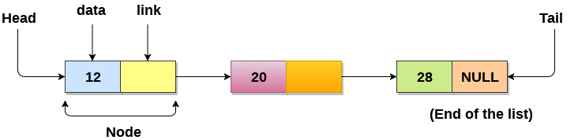

# Linked List

## Single Linked List

- linked list as collection of objects called `nodes`, are randomly in the memory.

- A node contains two fields i.e. `data` stored at that particular address and the `pointer` which contains the address of the next node in the memory.

- The last node of the list contains pointer to the null.

## Usee Linked List

A **Linked List** is a data structure that stores elements dynamically without requiring them to be contiguous in memory. Here's a simplified explanation:

1. **Flexible Memory Allocation**:  
   Elements (called nodes) don't need to be stored next to each other in memory. Each node contains a value and a pointer (or link) to the next node.

2. **Dynamic Size**:  
   The size of the list depends on the available memory and doesn't need to be predefined, unlike arrays.

3. **No Empty Nodes**:  
   Each node in the list holds an actual value and a pointer; there can't be empty or unused nodes.

4. **Versatile Data Storage**:  
   Nodes can store any type of data, whether it's primitive values (like numbers) or objects.

**Key Features of a Linked List:**

- Efficient use of memory since elements aren't stored contiguously.
- Easier to insert or delete elements without shifting other elements.
- Ideal for scenarios requiring dynamic or unpredictable sizing.

**Drawbacks:**

- Accessing an element requires traversing the list from the start (no direct access like arrays).
- Additional memory is needed for storing the pointer in each node.

## Why Use a Linked List Over an Array?

Arrays and linked lists are both used to store collections of elements, but linked lists provide certain advantages over arrays in specific scenarios due to the limitations of arrays:

### Limitations of Arrays:

1. **Fixed Size**:  
   The size of an array must be defined before use. If the size is underestimated, the array may run out of space. If overestimated, it wastes memory.

2. **Resizing**:  
   Expanding an array during runtime is time-consuming. It often involves creating a new array with a larger size and copying all the elements into it.

3. **Memory Contiguity**:  
   All elements in an array need to be stored in contiguous memory locations. This can be restrictive when dealing with large data.

4. **Insertion Overhead**:  
   Adding an element in the middle of an array requires shifting all subsequent elements to make space, which can be computationally expensive.

---

### Advantages of Linked Lists:

1. **Dynamic Memory Allocation**:  
   Linked lists allocate memory for each node dynamically. You don’t need to know the size in advance, and the structure can grow or shrink as needed.

2. **Non-Contiguous Storage**:  
   Nodes in a linked list are stored in non-contiguous memory locations. This allows better utilization of fragmented memory.

3. **Efficient Insertions and Deletions**:  
   Adding or removing elements from a linked list doesn’t require shifting elements. You simply update pointers to include or exclude a node.

4. **Flexible Sizing**:  
   A linked list can grow to use all available memory without needing reallocation or predefined limits.

---

### When to Use a Linked List:

- When the size of the collection is unknown or expected to change frequently.
- When frequent insertions and deletions are required, especially in the middle of the collection.
- When memory fragmentation makes contiguous allocation difficult.

### When to Use an Array:

- When fast access to elements by index is a priority.
- When the collection size is predictable and unlikely to change.

By understanding these trade-offs, you can choose the appropriate data structure based on the program’s requirements.

## Singly Linked List (One-Way Chain)

A **singly linked list** is a dynamic data structure that organizes elements (nodes) in a sequence where each node contains:

1. **Data Part**:  
   Stores the actual information or value.

2. **Link Part**:  
   Stores the address (or reference) of the next node in the sequence.

---

### **Key Characteristics**:

- **Dynamic Size**:  
  The list can grow or shrink as needed during program execution.

- **One-Way Traversal**:  
  Nodes are connected in a single direction using a pointer in each node. Traversing the list can only be done from the first node (head) to the last.

- **Sequential Access**:  
  Each node provides access only to the next node. To access a specific node, you must traverse the list sequentially from the head.

---

### **Limitations**:

1. **No Reverse Traversal**:  
   Since each node only has a pointer to the next node, traversing backward is not possible.

2. **Access Time**:  
   Direct access to a node is not possible. Searching for a specific node requires traversal from the head.

---

### Use Cases:

- Suitable for applications where memory allocation is unpredictable or dynamic.
- Efficient for adding or removing nodes at the beginning or middle of the list.
- Useful in scenarios like managing a dynamic queue, stack, or adjacency list in graph representation.

## Time Complexity:

Here's a breakdown of the **time complexity** and **space complexity** for a **Singly Linked List**:

---

### **Time Complexity:**

| **Operation**  | **Average Case (θ)** | **Worst Case (O)** |
|-----------------|-----------------------|---------------------|
| **Access**      | θ(n)                 | O(n)               |
| **Search**      | θ(n)                 | O(n)               |
| **Insertion**   | θ(1)                 | O(1)               |
| **Deletion**    | θ(1)                 | O(1)               |

---

### **Space Complexity:**

- **Worst Case**: O(n)

---

### **Explanation of Complexity**:

1. **Access**:  
   - Accessing a node requires traversal from the head to the desired position. This takes linear time **O(n)** on average and in the worst case.

2. **Search**:  
   - Searching for a specific value requires iterating through the entire list. Hence, it takes linear time **O(n)** in both average and worst cases.

3. **Insertion**:  
   - Inserting a node at the beginning or at a given position (if the position is already known) takes constant time **O(1)** because it simply involves pointer manipulation.

4. **Deletion**:  
   - Deleting a node is similar to insertion. If the node to be deleted is already known, it takes constant time **O(1)** to update pointers.

5. **Space Complexity**:  
   - The list requires **O(n)** space because each node stores both data and a pointer to the next node.

This makes singly linked lists a good choice for applications requiring frequent insertions and deletions, but less ideal for random access or frequent searches.

---

## Some common examples where **singly linked lists** are used:

### **1. Dynamic Queue Implementation**

- A singly linked list can represent a **queue**, where:
  - **Enqueue** (insertion) happens at the end.
  - **Dequeue** (deletion) happens at the front.
- Example: Task scheduling in operating systems.

### **2. Dynamic Stack Implementation**

- A singly linked list can represent a **stack**, where:
  - **Push** (insertion) happens at the beginning or end.
  - **Pop** (deletion) happens at the same end.
- Example: Undo functionality in text editors.

### **3. Polynomial Representation**

- Each node in the list represents a term of the polynomial:
  - **Data Part**: Coefficient and exponent.
  - **Link Part**: Pointer to the next term.
- Example: Representing a polynomial like \(5x^3 + 3x^2 + 2x + 1\).

### **4. Sparse Matrix Representation**

- Non-zero elements of a sparse matrix are stored as nodes in a linked list.
- Each node contains:
  - Row index, column index, and value.
  - Pointer to the next non-zero element.
- Example: Representing large matrices in computer graphics.

### **5. Hash Table Chaining**

- Singly linked lists are used in **collision resolution** in hash tables.
- Each bucket in the hash table contains a linked list of elements with the same hash value.
- Example: Efficient implementation of dictionaries or maps.

### **6. Adjacency List in Graphs**

- Used to store adjacent nodes of a graph node.
- Each node in the list represents a neighbor of the graph vertex.
- Example: Representing social networks or road networks.

### **7. Undo/Redo Operations**

- Singly linked lists can track actions performed in a sequence.
- Example: Tracking user actions in text editors or drawing applications.

These examples highlight the versatility of singly linked lists in dynamic data management and efficient storage.